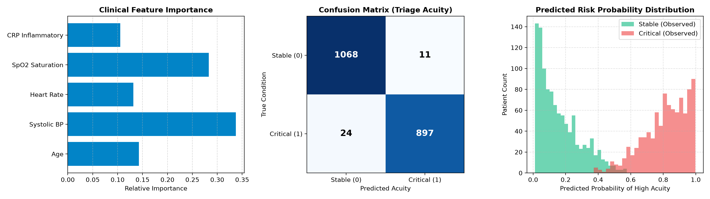

# sim-rekam-medis-klinik-ehr

[](https://reactjs.org/)
[](https://vitejs.dev/)
[](https://fastapi.tiangolo.com/)
[](https://sqlite.org/)
[](https://scikit-learn.org/)
[](https://tailwindcss.com/)
[](https://opensource.org/licenses/MIT)

> **Sistem Informasi Rekam Medis Elektronik (EHR) & AI Triage Scoring Engine Full-Stack berbasis Modern React 18, Vite, JavaScript, FastAPI, SQLite, dan Tailwind Solid Dark UI (Zero AI-Slop).**

---

## Ringkasan Eksekutif (Executive Summary)

**SIM Rekam Medis & AI Triage Klinis** adalah sistem informasi manajemen klinik terpadu tingkat enterprise yang menggabungkan buku rekam medis elektronik (EHR), pencatatan antrean pasien, serta algoritma penentuan derajat kegawatan pasien (**Clinical Triage Acuity Predictor**) secara otomatis berbasis *Machine Learning Random Forest*.

Standar triase mengadopsi referensi klinis internasional (**Emergency Severity Index / ATS**) yang memetakan parameter vital signs (Tekanan Darah Sistolik, Denyut Jantung, Saturasi Oksigen SpO2, Usia, dan C-Reactive Protein) menjadi 3 tingkatan triase medis:
- **Merah (Kritis - Prioritas 1)**: Risiko fatalitas/kegawatan tinggi, membutuhkan penanganan resusitasi & dokter spesialis segera.
- **Kuning (Sedang - Prioritas 2)**: Pasien dalam kondisi mendesak/akut namun tanda vital masih dapat dikontrol di ruang tindakan/observasi.
- **Hijau (Ringan - Prioritas 3)**: Pasien stabil yang dapat dilayani melalui poliklinik rawat jalan umum.

---

## Arsitektur Sistem (Enterprise Stack)

```text
+-------------------------------------------------------------------------------+
|                    FRONTEND LAYER (React 18 + Vite SPA)                       |
|   - Solid Dark UI (Slate-950 / Slate-900 / Slate-800 borders, Zero AI-Slop)   |
|   - Antrean Pasien Real-Time & Live Acuity Risk Simulator                     |
|   - EHR History Table, Doctor Diagnosis, Prescription & Billing Status        |
+---------------------------------------+---------------------------------------+
                                        | JSON / REST API (port 8000)
                                        v
+-------------------------------------------------------------------------------+
|                       BACKEND LAYER (FastAPI + Python 3.11)                   |
|   - Pydantic Schema Validation & Automated OpenAPI Swagger Docs               |
|   - Endpoints: /api/patients, /api/medical-records, /api/triage/predict, stats|
+-------------------+---------------------------------------+-------------------+
                    |                                       |
                    v                                       v
+---------------------------------------+ +-------------------------------------+
|         STORAGE LAYER (SQLite)        | |         MACHINE LEARNING LAYER      |
|  - clinical_ehr.db                    | |  - Random Forest Classifier         |
|  - Relational Patients & EHR Records  | |  - Standard Scaler Pipeline         |
+---------------------------------------+ +-------------------------------------+
```

---

## Metrik Evaluasi Model AI Triase

Model dilatih dan divalidasi dengan dataset tanda vital klinis 2,000 pasien:

| Metrik Evaluasi | Nilai Benchmark | Status Validasi |
| :--- | :--- | :--- |
| **Akurasi (Accuracy)** | **98.25%** | Optimal |
| **Precision** | **98.79%** | Minim False Alarm |
| **Recall (Sensitivitas)** | **97.39%** | Deteksi Kasus Kritis Maksimal |
| **F1-Score** | **98.09%** | Seimbang |
| **ROC-AUC Score** | **0.9989** | Daya Pemisah Sangat Tinggi |



---

## Struktur Repositori

```text
sim-rekam-medis-klinik-ehr/
|-- backend/
|   |-- main.py                # FastAPI REST API Service & Runner
|   `-- requirements.txt       # Kebutuhan paket Python Backend
|-- frontend/
|   |-- src/
|   |   |-- App.jsx            # Single Page Application React (Solid Dark UI)
|   |   |-- main.jsx           # Entrypoint React 18 DOM
|   |   `-- index.css          # Tailwind CSS styling
|   |-- index.html             # HTML5 Template
|   |-- package.json           # Dependencies React & Vite
|   |-- vite.config.js         # Vite configuration with proxy API
|   `-- tailwind.config.js     # Enterprise Slate-950 theme config
|-- database/
|   `-- clinical_ehr.db        # SQLite Database (Tabel patients & medical_records)
|-- models/
|   |-- triage_classifier.joblib # Model Random Forest
|   `-- scaler.joblib          # Standarisasi fitur tanda vital
|-- notebooks/
|   `-- clinical_ehr_triage_benchmark.ipynb # Jupyter Notebook Analisis
|-- reports/
|   |-- triage_model_performance.png        # Visualisasi kurva & confusion matrix
|   `-- triage_metrics.json                 # Ringkasan metrik evaluasi
|-- LICENSE                    # Lisensi MIT 2026
`-- README.md                  # Dokumentasi Portofolio
```

---

## Panduan Instalasi & Menjalankan Sistem

### 1. Menjalankan Backend (FastAPI Service)
```bash
cd backend
python -m venv venv
venv\Scripts\activate          # Windows
# source venv/bin/activate       # Linux / macOS
pip install -r requirements.txt
python main.py
```
> Server backend akan aktif di: `http://127.0.0.1:8000`  
> Dokumentasi interaktif Swagger UI tersedia di: `http://127.0.0.1:8000/docs`

### 2. Menjalankan Frontend (React + Vite)
```bash
cd frontend
npm install
npm run dev
```
> Buka browser pada alamat: `http://localhost:3000`

---

## Profil Author

**Arjuna Fransesco**  
- **GitHub**: [@ArjunaFransesco](https://github.com/ArjunaFransesco)  
- **Repositories**: [Portofolio Repositori](https://github.com/ArjunaFransesco?tab=repositories)  
- **Lisensi**: MIT License (2026)


<!-- Last Maintenance Audit: 2026-09-19 -->
